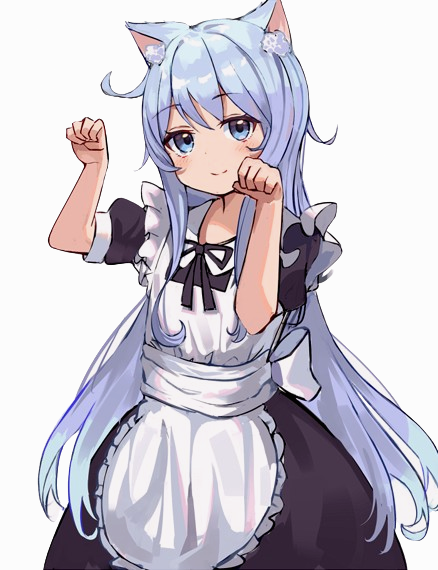

# catgirls_anytime

A CLI app dedicated to downloading images of catgirls. What more do you need?

Based off [nekos.moe](https://nekos.moe)'s [API](https://docs.nekos.moe).

## Roadmap

[x] opening images in user's default image viewer.

~~[ ] showing the images in the terminal, like the kitty terminal.~~

[ ] config files

[ ] make code readable by splitting them into functions

## Attribution

The image seen above is a transparent version of [https://nekos.moe/post/Gu8dj-_mB](https://nekos.moe/post/Gu8dj-_mB).

## Legal

Do whatever. This is licensed under the <a href="http://www.wtfpl.net/" target="_blank"><b>DO WHAT THE FUCK YOU WANT TO PUBLIC LICENSE</b></a>.
